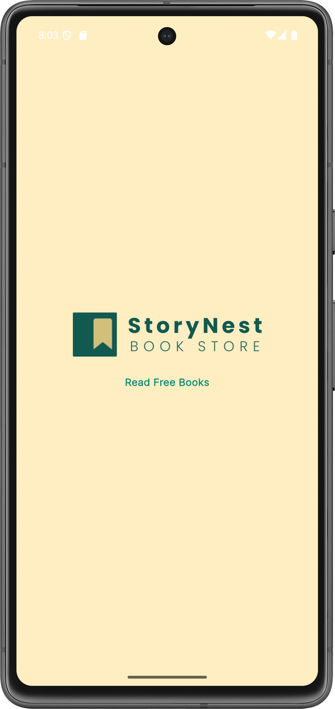
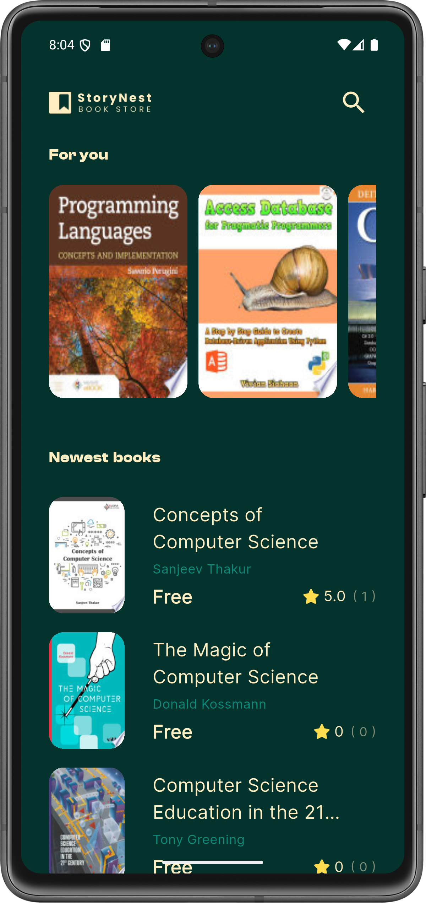
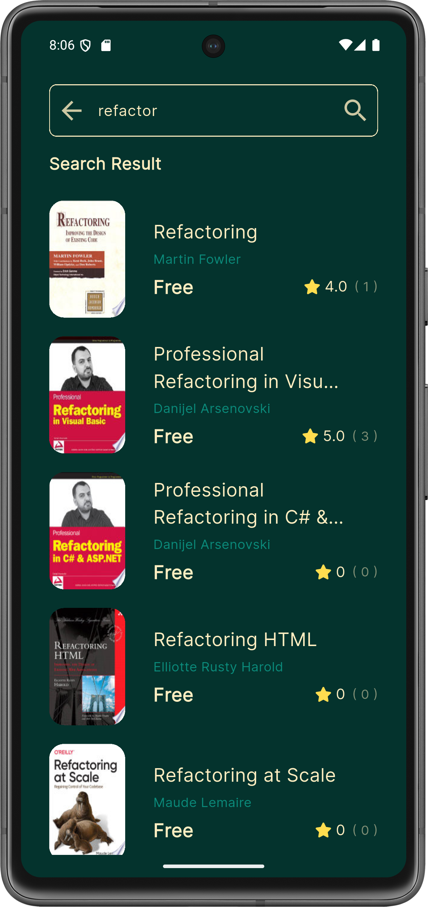
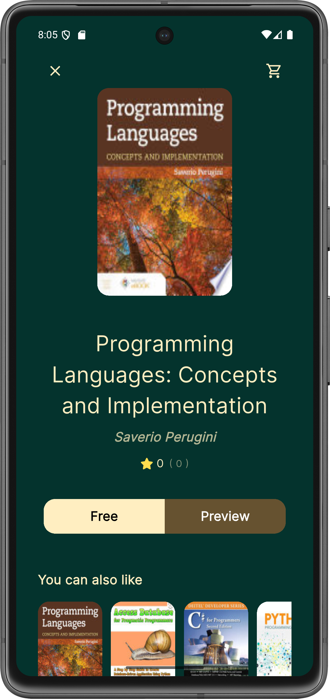
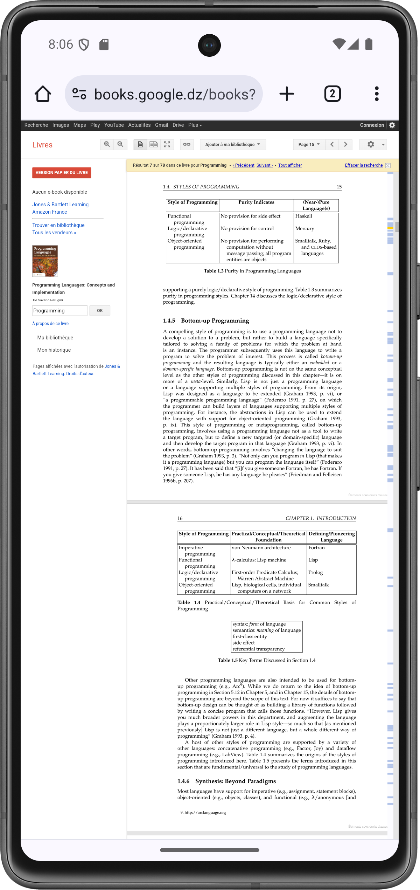

# StoryNest: Book Store Mobile App
[](https://deepwiki.com/Nidhal-Khazene/Book-Store-Mobile-App)

StoryNest is a sleek and modern mobile book store application built with Flutter. It leverages the Google Books API to provide users with a seamless experience for discovering, searching, and previewing a vast collection of books. The app is designed with a clean architecture, ensuring scalability and maintainability.

## Google API Link

*   **[Google API Link](https://www.googleapis.com/books/v1/volumes?q=Programming)**

## ✨ Features

- **Splash Screen:** An animated entry point into the application.
- **Dynamic Home Page:**
    - Displays a curated list of "Featured Books".
    - Shows the "Newest Books" in Computer Science.
- **Advanced Book Search:**
    - Search for books using keywords.
    - View search results in a clear, organized list.
- **Detailed Book Information:**
    - Tap on any book to see its details, including title, author(s), average rating, and rating count.
- **Book Previews:**
    - Access free previews of books directly through an external link.
- **Content-based Recommendations:**
    - View a list of "You can also like" books based on the current book's category.
- **Robust State Management:** Utilizes BLoC (Cubit) for predictable and efficient state handling.
- **Error Handling:** Gracefully handles API errors and network issues with user-friendly messages.

## Screenshots
|                                Splash Screen                                |                                   Home Screen                                    |
|:---------------------------------------------------------------------------:|:--------------------------------------------------------------------------------:|
|  |  |

|                                    Search Screen                                     |                                  Details Screen                                   |
|:------------------------------------------------------------------------------------:|:---------------------------------------------------------------------------------:|
|  |  |

|                                    Book Preview Screen                                    |                                                                                   |
|:-----------------------------------------------------------------------------------------:|:---------------------------------------------------------------------------------:|
|  |                                                                                   |


## 🏗️ Architecture & Tech Stack

This project follows a clean, feature-first architecture to separate concerns and improve scalability.

- **Core:** Contains shared components, utilities, and a base setup for the entire application.
    - `utils`: Service locator (`get_it`), API service (`dio`), and routing (`go_router`).
    - `errors`: Custom failure classes for handling API and server errors.
    - `widgets`: Reusable custom widgets like buttons and loading indicators.
- **Features:** The application is divided into distinct features: `splash`, `home`, and `search`. Each feature module contains its own `data` and `presentation` layers.
    - `data`:
        - **Models:** Dart classes representing the book data from the Google Books API.
        - **Repositories:** Abstract classes defining contracts for data operations and their concrete implementations (`HomeRepo`, `SearchRepo`).
    - `presentation`:
        - **Manager (Cubit):** State management logic using `flutter_bloc` to handle UI state and business logic.
        - **Views:** The screens and UI of the application.
        - **Widgets:** UI components specific to a particular feature.

### Key Technologies

- **Framework:** [Flutter](https://flutter.dev/)
- **State Management:** [flutter_bloc](https://pub.dev/packages/flutter_bloc)
- **Dependency Injection:** [get_it](https://pub.dev/packages/get_it)
- **Routing:** [go_router](https://pub.dev/packages/go_router)
- **Networking:** [dio](https://pub.dev/packages/dio)
- **Functional Programming:** [dartz](https://pub.dev/packages/dartz) (for `Either` type)
- **Value Equality:** [equatable](https://pub.dev/packages/equatable)
- **UI:**
    - [cached_network_image](https://pub.dev/packages/cached_network_image) for efficient image loading.
    - [google_fonts](https://pub.dev/packages/google_fonts) for typography.
    - [font_awesome_flutter](https://pub.dev/packages/font_awesome_flutter) for icons.

## 🚀 Getting Started

To get a local copy up and running, follow these simple steps.

### Prerequisites

- [Flutter SDK](https://flutter.dev/docs/get-started/install) installed on your machine.

### Installation

1.  **Clone the repository:**
    ```sh
    git clone https://github.com/Nidhal-Khazene/Book-Store-Mobile-App.git
    ```

2.  **Navigate to the project directory:**
    ```sh
    cd Book-Store-Mobile-App
    ```

3.  **Install dependencies:**
    ```sh
    flutter pub get
    ```

4.  **Run the application:**
    ```sh
    flutter run
    ```

## 📝 License

This project is licensed under the MIT License - see the [LICENSE](LICENSE) file for details.